# 基本理论知识
如果您觉得阅读基本理论知识比较Boring，可以先进行第二部分的动手操作再来回顾或者找资料/书籍学习自己比较困惑的地方。
## 什么是GitHub
GitHub 是为开发者提供Git 仓库的托管服务。这是一个让开发者与朋友、同事、同学及陌生人共享代码的完美场所。当然，它不止于共享代码。

## Git 和 GitHub 的关系
在此讲解一下GitHub 与Git  的区别。GitHub 与Git 是完全不同的两个东西。在Git 中，开发者将源代码存入名叫“Git 仓库”的资料库中并加以使用。而GitHub 则是在网络上提供Git 仓库的一项服务。也就是说，GitHub 上公开的软件源代码全都由Git 进行管理。理解Git，是熟练运用GitHub 的关键所在。

## 关于Branch/分支
在进行多个并行作业时，我们会用到分支。在这类并行开发的过程中，往往同时存在多个最新代码状态。如图4.1 所示，从master 分支创建feature-A 分支和fix-B 分支后，每个分支中都拥有自己的最新代码。master 分支是Git 默认创建的分支，因此基本上所有开发都是以这个分支为中心进行的。

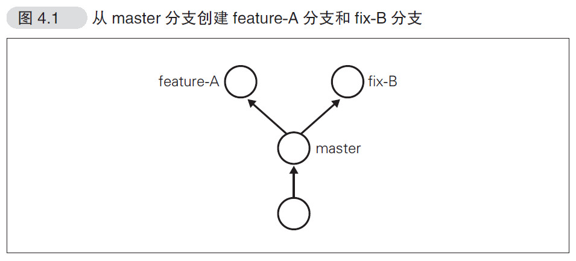

不同分支中，可以同时进行完全不同的作业。等该分支的作业完成之后再与master 分支合并。比如feature-A 分支的作业结束后与master合并，如图4.2 所示。通过灵活运用分支，可以让多人同时高效地进行并行开发。

## 主要功能

### ●Git 仓库
一般情况下，我们可以免费建立任意个GitHub提供的Git仓库。但如果需要建立只对特定人物或只对自己公开的私有仓库，则需要依照套餐类型B 支付每月最低7 美元的使用费。在校生有[校园优惠](https://education.github.com/)，可以免费申请GitHub Pack。

### ●Organization
通常来说，个人使用时只要使用个人账户就足够了，但如果是公司，建议使用Organization账户。它的优点在于可以统一管理账户和权限，还能统一支付一些费用。如果只使用公开仓库，是可以免费创建Organization 账户的。因此，如果是以交流群或IT 小团体的形式进行软件开发时不妨试一试。

#### ●Issue
Issue 功能，是将一个任务或问题分配给一个Issue 进行追踪和管理的功能。可以像BUG 管理系统或TiDD（Ticket-driven Development）的Ticket 一样使用。在GitHub 上，每当进行我们即将讲解的Pull Request，都会同时创建一个Issue。每一个功能更改或修正都对应一个Issue，讨论或修正都以这个Issue 为中心进行。只要查看Issue，就能知道和这个更改相关的一切信息，并以此进行管理。在Git 的提交信息中写上Issue 的ID（例如“#7”），GitHub 就会自动生成从Issue 到对应提交的链接。另外，只要按照特定的格式描述提交信息，还可以关闭Issue。这是一个非常方便的功能，请务必实践一
下。

### ●Wiki
通过Wiki 功能，任何人都能随时对一篇文章进行更改并保存，因此可以多人共同完成一篇文章。该功能常用在开发文档或手册的编写中。语法方面，可以通过第5 章讲解的GFM 语法进行书写。Wiki 页也是作为Git仓库进行管理的，改版的历史记录会被切实保
存下来，使用者可以放心改写。由于其支持克隆至本地进行编辑，所以程序员使用时可以不必开启浏览器。

### 核心功能Pull Request
Pull Request 是指开发者在本地对源代码进行更改后，向GitHub 中托管的Git 仓库请求合并的功能。开发者可以在Pull Request 上通过评论交流，例如“修正了BUG，可以合并一下吗？”以及“我试着做了这样一个新功能，可以合并一下吗？”等。通过这个功能，开发者可以轻松更改源代码，并公开更改的细节，然后向仓库提交合并请求。而且，如果请求的更改与项目的初衷相违，也可以选择拒绝合并。GitHub 的Pull Request不但能轻松查看源代码的前后差别，还可以对指定的一行代码进行评论。通过这一功能，开发者们可以针对具体的代码进行讨论，使代码审查的工作变得前所未有地惬意。
开发者向GitHub 的仓库推送更改或功能添加后，可以通过Pull Request 功能向别人的仓库提出申请，请求对方合并。
Pull Request 送出后，目标仓库的管理者等人将能够查看Pull Request 的内容及其中包含的代码更改。
同时，GitHub 还提供了对Pull Request 和源代码前后差别进行讨论的功能。

# 准备工作
## Git的安装
git的安装非常的简单，读者下载好Git后按照默认安装基本即可。当然网上也有很多的博文帮助大家完成安装。笔者就不在这里演示了。
## 图像化工具GitHub DeskTop 安装
GitHub 公司提供了Git 客户端来辅助用户使用GitHub。该客户端有 [Mac版](https://mac.github.com/) 和 [Windows版](https://windows.github.com/) 两个版本。两个客户端提供的功能基本相同，只是由于OS 不同，所以UI 有些许差异。
同学们可以根据自己的电脑选择适合自己的客户端下载安装。
但这两个版本都提供一下功能：

    ● 从 GitHub端 clone仓库
    ● 显示仓库的历史记录
    ● 提交仓库的修改内容
    ● 切换分支
    ● 向 GitHub端进行 push
    另外，Mac 版还提供以下功能。
    ● 将通知发送至通知中心
    ● 与 GitHub Enterprise集成
读者搜索Github DeskTop下载安装即可。

# 实践操作

## 图形化操作

### 上传本地到云端

1. 前往github官网注册一个Github账号,填写好用户名，邮箱，密码

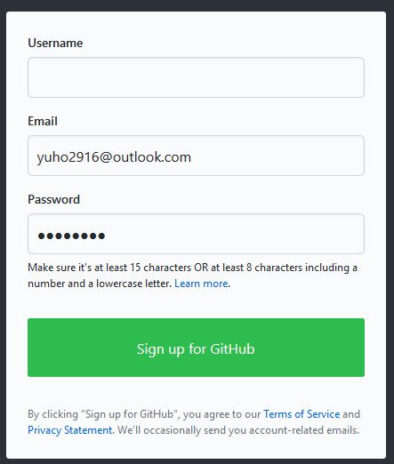

2. 登陆后能看到主页面，左侧栏是你的仓库列表，中间是消息列表，右侧是推荐给你的一些仓库列表。

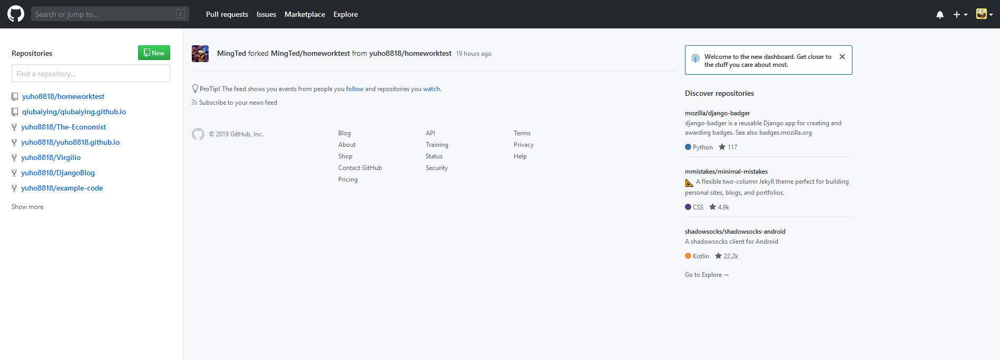

3. 下面，让我们来创建一个仓库，点击左侧仓库列表旁的new，新建一个名叫GithubTest的仓库，并可以添加一些描述，选择该仓库是Public的公有仓库，同时可以选择是否初始化一个readme，以及是否要使用license。

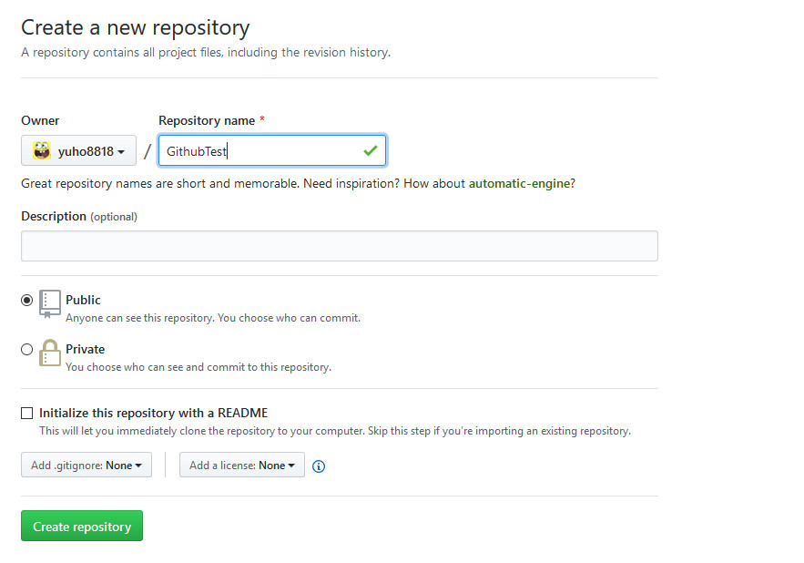

4. 创建仓库后，进入仓库页面，我们能看到现在仓库还是空的。我们使用桌面客户端打开。

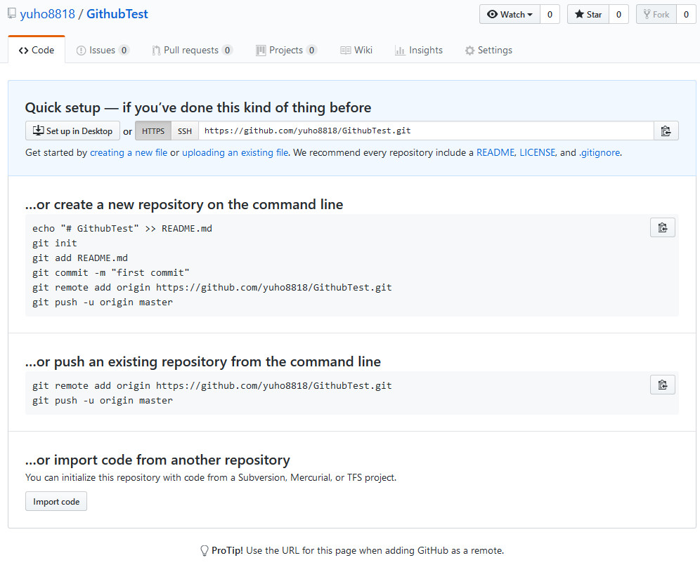

5. 选好本地路径，点击clone下

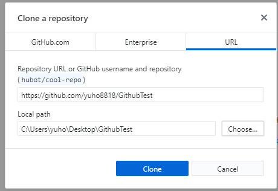

6. 我们在GithubTest目录下新建一个txt文件，随便写点什么后保存。打开GithubDeskTop我们能看到这次项目的修改，我们创建了一个文件，并且增加了什么内容。我们先Commit to Master, 然后Push Branch。这样，我们在本地的修改就提交到了云端。登陆GitHub官网，我们能看到我们的修改。

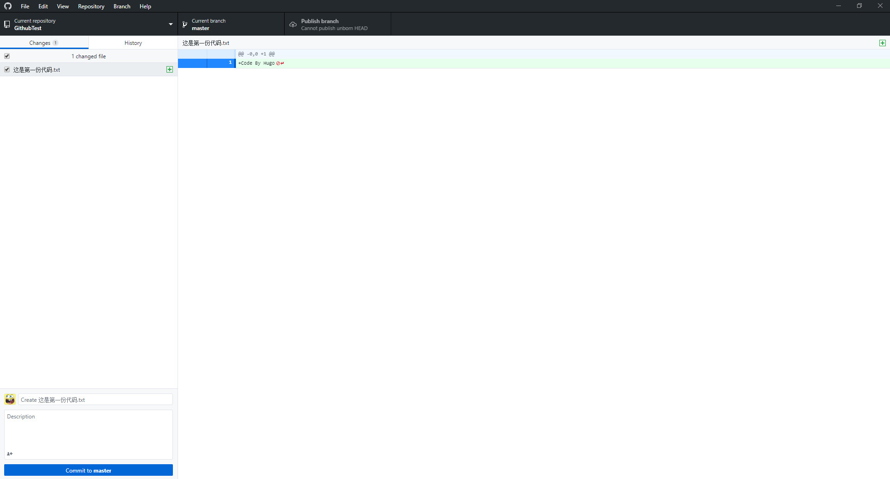

### 另一账号Fork本仓库

1. 现在笔者用另一个账号登陆Github，搜索到笔者刚刚创建的仓库，然后点击右上角的Fork来协同开发。
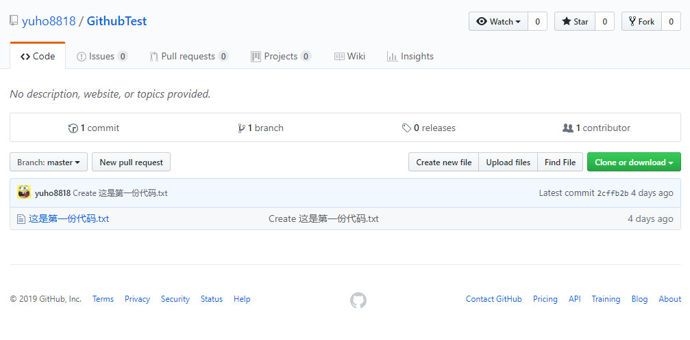

2. Fork完以后能在当前账号的仓库主页面看到这个项目仓库，我们点击进入该项目，然后创建一个新文件（create new file）。可以看到我们创建了一个This is code2 的新代码文件，并添加了新的内容。
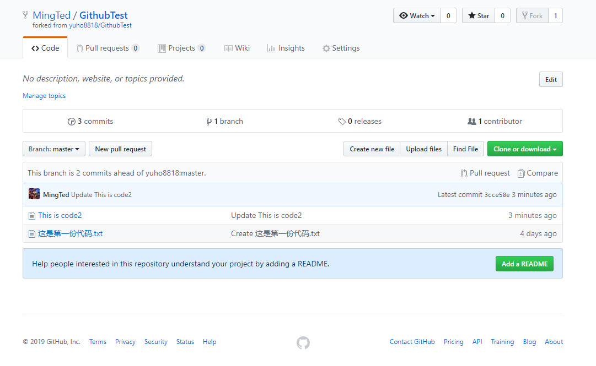

3. 到这一步可能许多同学会问了，这个账号写的代码同步到另一个账号。步骤如下，在本账号下点击New pull request, 新建一个一个PullRequest请求。在页面中我们能看到所做的一些修改。
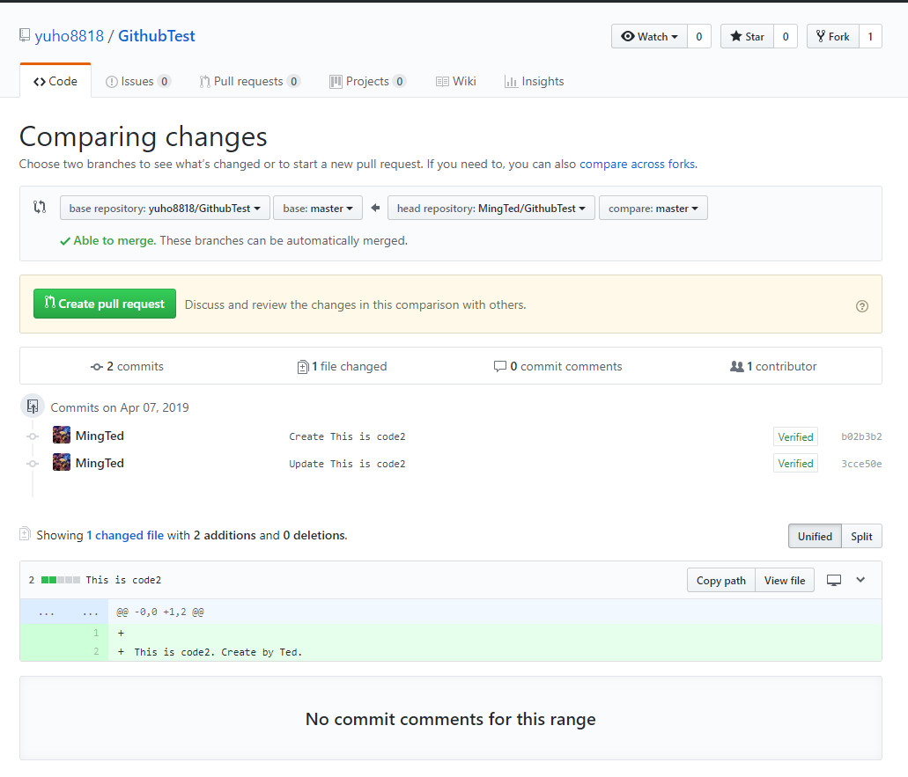

4. 此时我们切回到原来的主账号，能看到在GithubTest项目下有一个新的PullRequset请求，这时我们对该请求进行检查，确认该分支与我们的基础分支无误后可以对分支进行合并。Merge Pull Request! 再点击进入主账号该仓库主页我们就能看到代码已经修改了。但是需要注意的是，这里合并了只是远程云端的仓库变了，你本地的文件内容并没有改变，那么接下来，我们把远端的代码拉到本地。

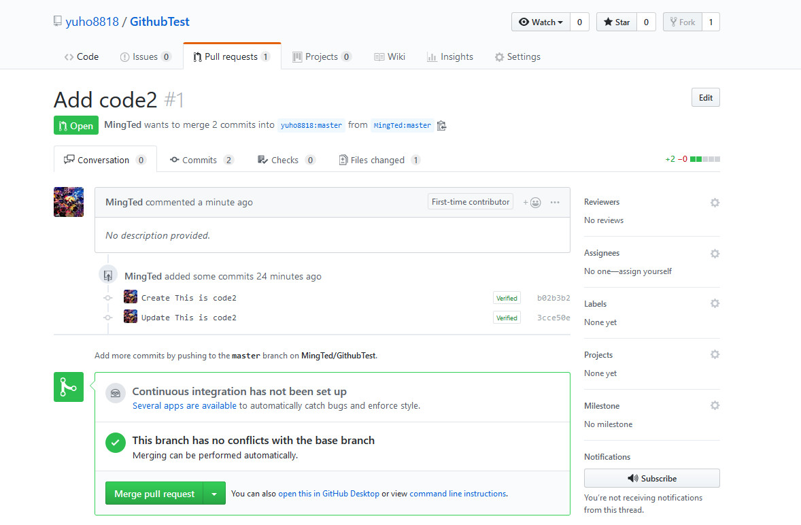

5.打开GitHub DeskTop. 点击Pull Origin. 把本地代码跟远程代码进行同步。完成后，你能看到副账号提交的代码同步到了本地。

### 版本的回退

很多时候，项目的开发并不是一帆风顺的，很有可能发现当前的开发有错，需要回退到原先的版本。接着上面的场景，我们发现This is code2 文件有错，需要回复到我们拉取This is code2 之前，那么我们打开GithubDeskTop， 点击GitHubTest仓库的history, 我们能看到有一次Merge的操作，右键点击这次操作，点击Revert this Commit. 我们能看到我们本地的文件中This is code2 文件不见了。 当然，这只是当前本地仓库的修改，你需要把修改Push 到云端，那么你能看到云端仓库里This is code2 文件也不见了。

### 分支的创建

在DeskTop下点击Current Branch，您能看到您项目的分支数量，点击New branch 你就可以创建一个新的分支了。让我们来创建一个branch2。并切换到branch2 下。

### 分支的合并

在创建完branch2 后，我们在GithubTest目录下创建一个branch2测试的txt文件，代表我们在branch2下进行了代码开发。回到DeskTop, 你能看到GithubDeskTop已经检测到了我们新创建的txt文件。我们把分支和更新push到云端仓库。然后登陆您的GitHub网页账号，您能看到您的GitHubTest项目仓库多了一个分支。
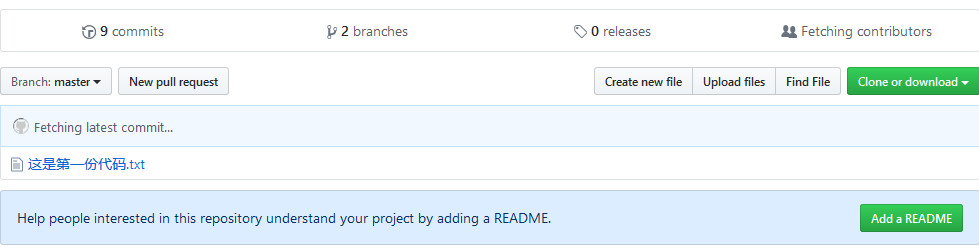
接下来就是分支的合并。点击New pull request。选择将branch2分支pull request到master。Comment pull request请求后再Merge pull request。这样你就完成了分支的合并。和Folk别人的代码进行Pull Request大同小异。
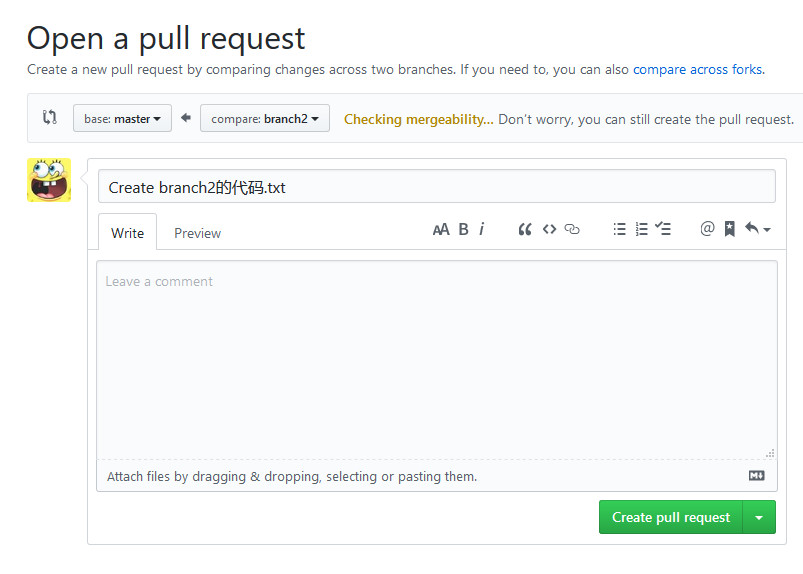

### 关于分支和Flok

有些同学可能会对Folk和分支感到疑惑。是这样，Folk你可以理解为你继承了别人的项目，并自己进行一些开发，一般你在GitHub上找到一些开源项目想自己玩玩都是Folk下别人的，然后进行开发。分支是属于项目内部，你跟你的小伙伴一起开发项目基本都会考虑在不同的分支下进行开发。

## 命令行联系
虽然图形化操作能够满足所有的基本操作，现在很多开发工具/IDE也集成了Git版本控制功能，但是有经验的程序员都会喜欢使用命令行的形式来操作Git。但Git命令行在没有学习Linux Shell 命令时学习可能会让读者觉得颇有难度，所以笔者便不在这里带大家练习Git命令了，相信大家在学习完

# 后序
笔者在这里做的都是最简单的讲解，以用户图形化界面的形式对Github进行操作，只能说这是入门级中的入门级操作。如果读者想更深层次的学习GitHub，笔者推荐大家阅读由大塚弘记编写的《GitHub入门与实践》，你能发现日本作家大塚弘记以手把手式教学方式带给你的Git 以及GitHub 教学。当然，像笔者之前提及的，GitHub不止是代码的共享，笔者就有用GitHub来创建一个自己的博客，如果您也对用GitHub Pages 来创建博客感兴趣，可以上网查查相关内容，或者参考这个[连接](https://github.com/yuho8818/yuho8818.github.io)。
