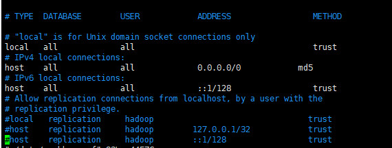
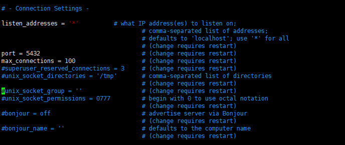
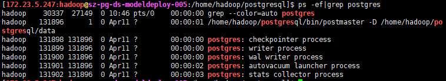

---
layout:     post
title:      Linux 安装postgresql
subtitle:   centos7.5 安装postgresql9.6.8及uuid-ossp
date:       2019-04-12
author:     Hugo Yu
header-img: img/linux.jpg
catalog: true
tags:
    - Linux
    - Postgresql
---

    


# 安装
因为
1. 没有root用户，账户为有sudo权限的hadoop用户，无法新建带sudo权限的系统用户
2. linux没连外网。

所以服务器配置上和常规有所不同

## 1.查看Linux版本

此命令也适用于所有的Linux发行版
```
cat /etc/issue
```
Redhat 系的Linux能查到发行版本的版本号
```
cat /etc/redhat-release
```
查到版本是centos 7.5

## 2.下载postgresql源码包
浏览器访问 https://www.postgresql.org/ftp/source/ 
选择对应版本，应领导要求下载好9.6.8。下载好后上传到服务器你自己的目录。

## 3.下载相关依赖包
从 http://mirrors.aliyun.com/centos/7/os/x86_64/Packages/  下载 ncurses-devel-5.9-14.20130511.el7_4.x86_64.rpm 和 readline-devel-6.2-10.el7.x86_64.rpm 并上传到服务器。这两个包是安装postgresql所必须的，否则在安装postgresql时会报```configure：error：readline library not found``` 错误，而你通过通过命令 ```rpm -qa | grep readline``` 发现，服务器上是存在readline包的，出现这种情况一般是缺少相关 devel 包，即这里缺少了 readline-devel 包。这里仍采取步骤一讲述的方法进行获取以及安装，(readline-devel依赖于ncurses-devel，注意先后次序，先ncurses-devel后readline-devel）。安装命令如下 

```
rpm -ivh ncurses-devel-5.9-14.20130511.el7_4.x86_64.rpm
rpm -ivh readline-devel-6.2-10.el7.x86_64.rpm
```


## 4.解压源码包
```
tar -zxvf postgresql-9.6.10.tar.gz -C /home/hadoop
```
-C 后指定解压路径,/home/hadoop为hadoop用户路径

## 5.编译安装
进入解压后目录，通过命令 ```./configure --help``` 可以看到配置相关的帮助信息。
指定安装路径为/home/hadoop/postgresql
```
./configure --prefix=/home/hadoop/postgresql
```
接着就是编译和安装
```
make
make install
```
安装好后能看到/home/hadoop/postgresql 已经创建安装


## 6.相关配置
进入安装目录，

```cd /home/hadoop/```

创建data 和 log 目录
``` 
mkdir ./data
mkdir ./log
```

将安装路径下的所有文件授权给hadoop用户
```
sudo chown -R hadoop:hadoop /home/hadoop/postgresql
```

配置环境变量
```
sudo vim /etc/profile
```
追加如下内容


```
source /etc/profile
```
使其生效

使用```initdb --help```来查看数据库初始化帮助。
```initdb``` 初始化数据库。

进入数据库安装路径（/home/hadoop/postgresql）,配置数据库的访问控制
```
vim ./data/pg_hba.conf
```

配置如下（可以通过账号密码登陆）




```
vim ./data/postgresql.conf
```

配置如下（设置服务器监听整个网络，设置端口号为5432）



确认系统防火墙关闭
```
systemctl status firewalld.service
```

## 7.配置系统服务
进入postgresql源码包的解压目录(本文为 /home/hadoop/postgresql-9.6.10 )，执行命令 ```sudo cp contrib/start-scripts/linux /etc/init.d/postgresql```，然后 ```sudo vim /etc/init.d/postgresql```，进行配置修改


然后使用命令 ```sudo chmod +x /etc/init.d/postgresql```，赋予该文件执行权限。另外，还可以使用命令 ```sudo chkconfig --add postgresql```，设置服务开机自启。

## 8.启动连接数据库
使用命令 ```service postgresql start```，启动数据库服务。可以通过 ```ps -ef|grep postgres```，查看postgres相关进程。



启动成功后，可以通过 postgresql 自带的客户端工具 psql 来进行连接, 用户直接输入 ```psql```,结果发先报错```hadoop database not exits```之类的错误，这是因为postgresql默认会给postgres进行登陆，并创建一个postgres的表，而我们因为权限的问题，无法创建新用户，或者创建的系统用户也没有授权sudo，所以以hadoop用户进行配置，所以数据库内部也会创建一个hadoop的内部用户，而数据库名仍为postgres。

```createdb --help```来查看创建一张新表需要哪些参数。

```createdb --owner=hadoop --username=hadoop hadoop```创建一个名为hadoop的库，在使用 ```psql```您就能进入了。

然后您就能根据自己的需求创建数据库，创建数据库User


# 错误1
使用Navicat连接数据库，从其他数据库导入数据和函数时发现```language c is not support```，原因是你使用的数据库用户并非超级用户，psql登陆后把你授予你的数据库Role超级用户权限。
# 错误2
1. 导入函数不成功。报错```'$libdir/uuid-ossp```Not found。原因：PostgreSQL没有安装uuid-ossp。
    登陆psql，``` create extension "uuid-ossp" ;``` 报错```No such file or directory```;

2. 解决方法，进入postgresql解压路径（/home/hadoop/postgresql-9.6.8）,
    ```
    cd ./contrib/uuid-ossp/
    make
    make install
    ``` 
    make 报错
```
gcc -Wall -Wmissing-prototypes -Wpointer-arith -Wdeclaration-after-statement -Wendif-labels -Wmissing-format-attribute -Wformat-security -fno-strict-aliasing -fwrapv -fexcess-precision=standard -O2 -fPIC -I../../contrib/pgcrypto -I. -I. -I../../src/include  -D_GNU_SOURCE   -c -o uuid-ossp.o uuid-ossp.c
uuid-ossp.c:40:2: error: #error "please use configure's --with-uuid switch to select a UUID library"
 #error "please use configure's --with-uuid switch to select a UUID library"
  ^
uuid-ossp.c: In function ‘uuid_generate_internal’:
uuid-ossp.c:285:5: error: unknown type name ‘uuid_t’
     uuid_t  uu;
     ^
uuid-ossp.c:286:23: error: ‘uuid_s_ok’ undeclared (first use in this function)
     uint32_t status = uuid_s_ok;
```
原因：需要安装e2fsprogs-devel uuid-devel libuuid-devel，而安装这几个包有需要其他一些依赖。
所需包归结如下(有先后顺序)：
```
libuuid-2.23.2-59.el7.x86_64.rpm
uuid-1.6.2-26.el7.x86_64.rpm
libcom_err-1.42.9-13.el7.x86_64.rpm
pkgconfig-0.27.1-4.el7.x86_64.rpm
libcom_err-devel-1.42.9-13.el7.x86_64.rpm
e2fsprogs-libs-1.42.9-13.el7.x86_64.rpm
libuuid-devel-2.23.2-59.el7.x86_64.rpm
uuid-devel-1.6.2-26.el7.x86_64.rpm
e2fsprogs-devel-1.42.9-13.el7.x86_64.rpm

```
在https://www.postgresql.org/ftp/source/下载，并通过
```
rpm -ivh 相关包
```
进行安装，注意有些包系统可能已经有相应包，但版本不匹配，```rpm -ivh 包名 --force```进行强制安装更新。

装好后进入源码解压路径（/home/hadoop/postgresql-9.6.8）配置
```./configure --prefix=/home/hadoop/postgresql --with-uuid=ossp```

编译安装
```
cd ./contrib/uuid-ossp/
make && make install
```
进入psql
```
psql
create extension "uuid-ossp" ;
```
看到CREATE EXTENSION代表成功。接着再用NAVICAT把函数重新导过去。